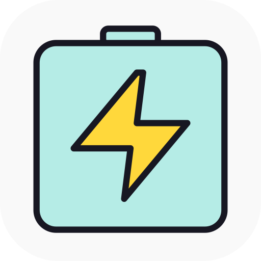
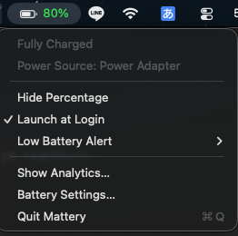
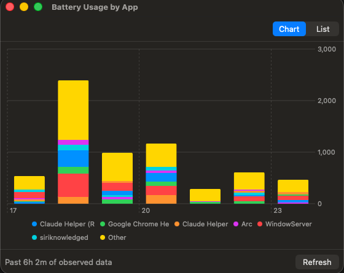

<p align="center">
  
</p>

<h1 align="center">Mattery</h1>

<p align="center">A menu bar app for macOS that always shows your battery percentage with color coding.</p>

<p align="center"><a href="README.ja.md">日本語</a> · <a href="README.ko.md">한국어</a></p>

## Screenshots

<p align="center">
  
  &nbsp;
  
</p>

## Download

Pre-built binary: **[latest release](https://github.com/puffer-dev/mattery/releases/latest)** (Apple Silicon, macOS 13+).

The binary is ad-hoc signed, not notarized by Apple, so the first launch is blocked by Gatekeeper. To allow it:

1. Unzip and move `Mattery.app` to `/Applications/`.
2. Right-click `Mattery.app` → **Open** (or Control-click → Open).
3. Click **Open** in the dialog. macOS will remember the choice.

Alternatively, strip the quarantine attribute from a terminal:

```sh
xattr -dr com.apple.quarantine /Applications/Mattery.app
```

## Features

- Color-coded percentage
  - 80% and up → green
  - 51–79% → yellow
  - 15–50% → orange
  - 14% and below → red
- Low-battery alerts (Notification / Sound / Both / Off, selectable from the menu)
  - 2–5%: only fires when not charging
  - 1% or below: fires regardless of charging state
  - Re-fires every 60 seconds while inside the low-battery zone
- Charging icon (lightning bolt) and `Time to Full` / `Charging…` shown in the menu
- Launch at Login via `SMAppService.mainApp`
- Toggle to hide the percentage label
- Per-app battery usage analytics (rolling 24h)
  - Samples `top` Energy Impact every 10 minutes
  - Chart (hourly stacked bars) and list (sortable table) views
  - Persisted to `~/Library/Application Support/Mattery/samples.jsonl`

## Requirements

- macOS 13 Ventura or later
- Xcode 16+ / Swift 5.9
- [xcodegen](https://github.com/yonaskolb/XcodeGen)

## Build

```sh
xcodegen generate
xcodebuild -project Mattery.xcodeproj -scheme Mattery -configuration Debug -destination 'platform=macOS' build
```

Or open `Mattery.xcodeproj` in Xcode and Run.

## Release

`scripts/release.sh` builds Release, replaces `/Applications/Mattery.app`, and relaunches it:

```sh
./scripts/release.sh
```

It quits any running instance, builds Release, copies into `/Applications`, re-signs ad-hoc, and launches the new build.

## Architecture

| File | Role |
| --- | --- |
| `MatteryApp.swift` | `@main`. Connects `AppDelegate` via `NSApplicationDelegateAdaptor`; uses a windowless `Settings` scene |
| `AppDelegate.swift` | Constructs and retains `BatteryMonitor` / `LowBatteryAlerter` / `EnergySampler` / `StatusBarController` / `AnalyticsWindowController` at launch |
| `BatteryStatus.swift` | Value type for battery state |
| `BatteryMonitor.swift` | IOPS snapshot reader; subscribes via `IOPSNotificationCreateRunLoopSource` + 30s polling |
| `StatusBarController.swift` | Builds and updates the `NSStatusItem`, including its menu |
| `LowBatteryAlerter.swift` | Detects rising-edge entry into the 5% / 1% zones; fires notification/sound and re-fires every 60s while in zone |
| `LaunchAtLoginManager.swift` | `SMAppService.mainApp` wrapper |
| `PreferencesStore.swift` | `UserDefaults` wrapper (`hidePercentage`, `lowAlertMode`) |
| `EnergySampler.swift` | Runs `top -l 2 -s 1 -o power -stats power,command` every 10 minutes and parses the output |
| `EnergyStore.swift` | Persists samples and computes the 24h rolling-window aggregates (per-app share + hourly breakdown) |
| `AnalyticsView.swift` | SwiftUI chart/list toggle UI |
| `AnalyticsWindowController.swift` | `NSWindowController` hosting the SwiftUI view |

`Info.plist` has `LSUIElement = YES` so the app stays out of the Dock and the app switcher, becoming menu-bar only.

## License

Apache License 2.0 — see [LICENSE](LICENSE).
